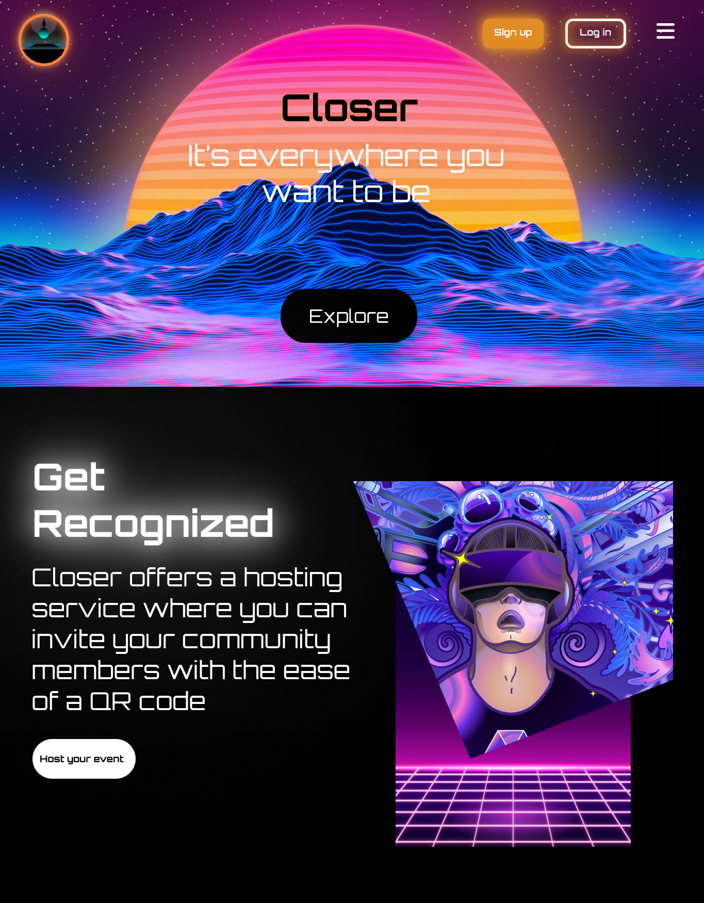
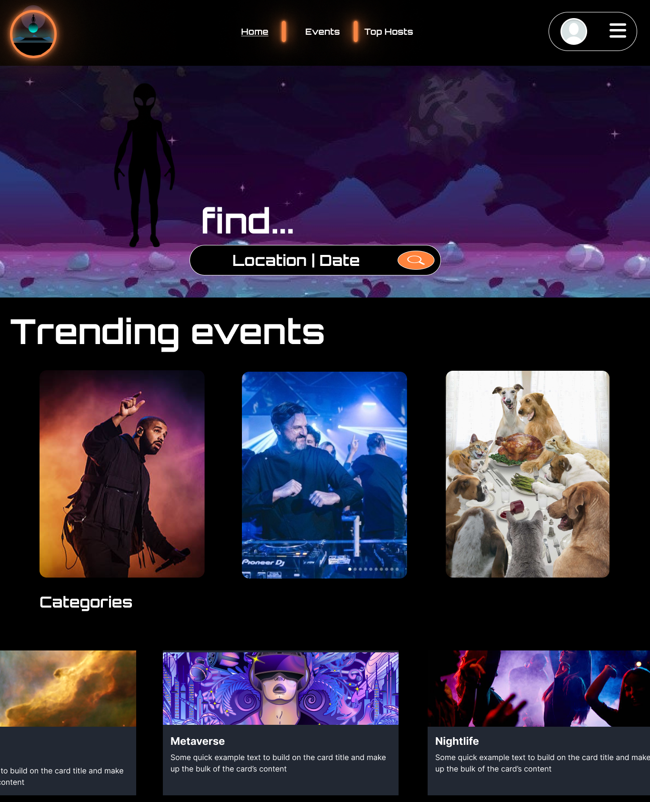
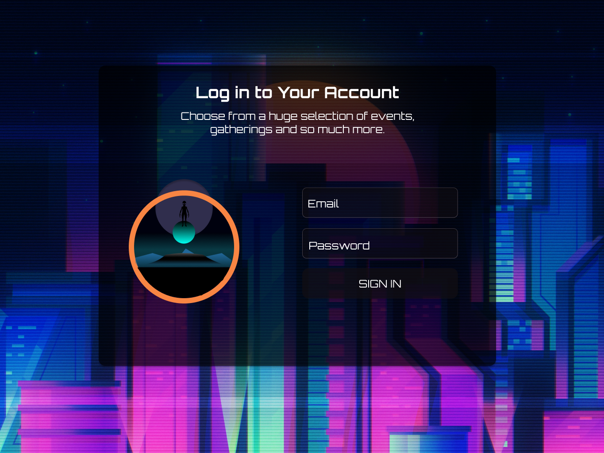
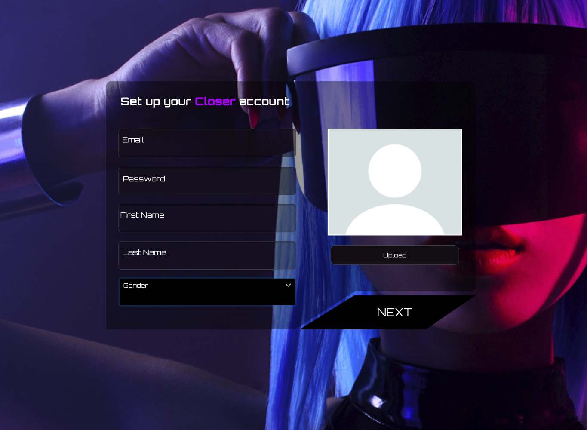
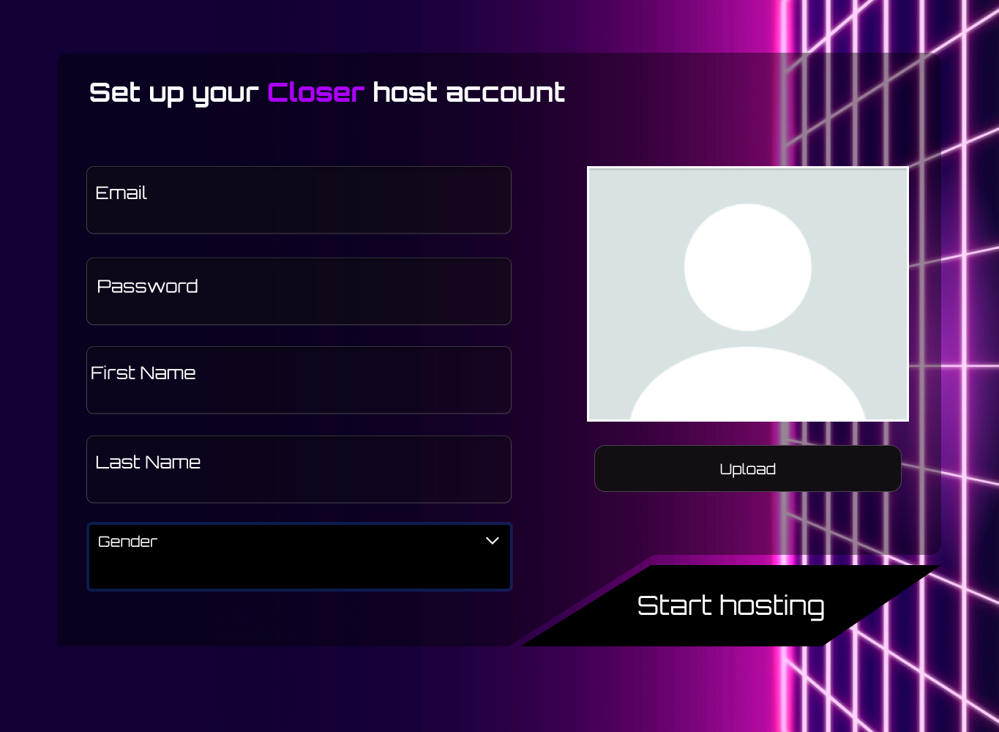
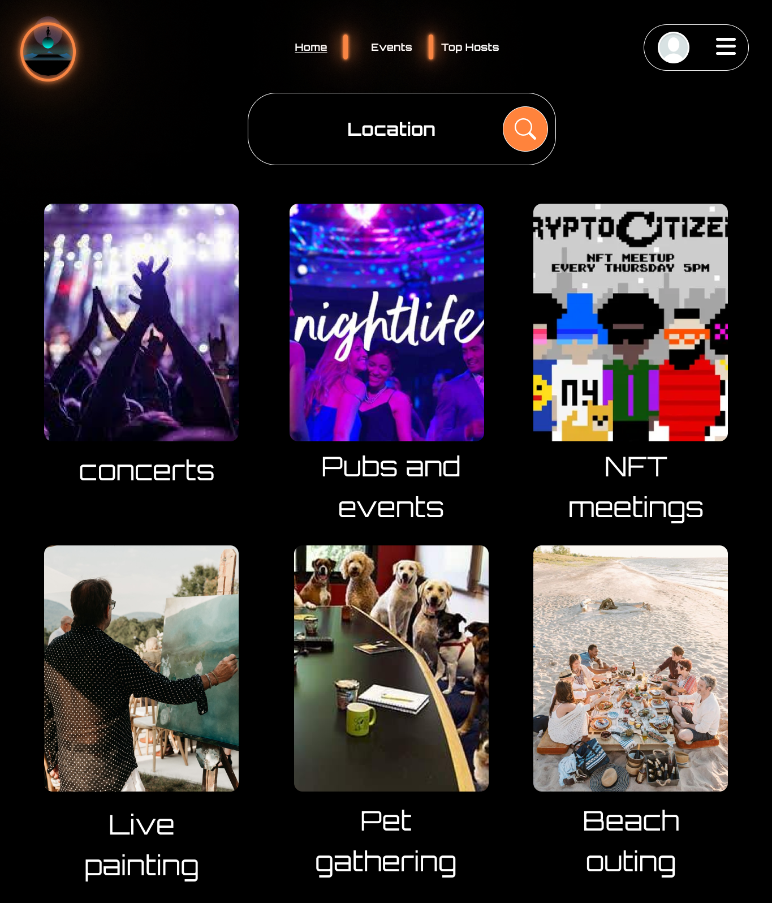
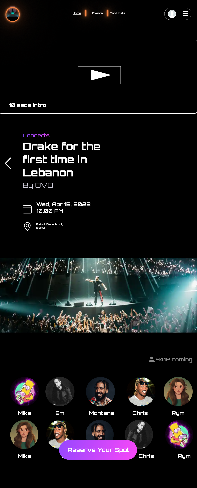
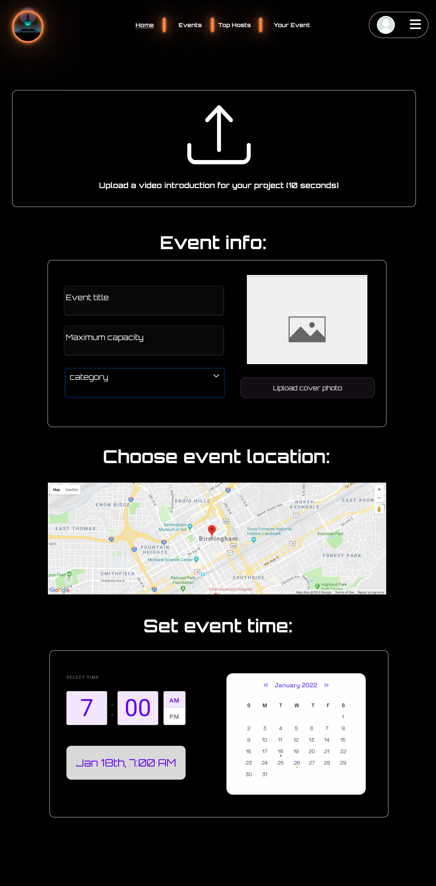
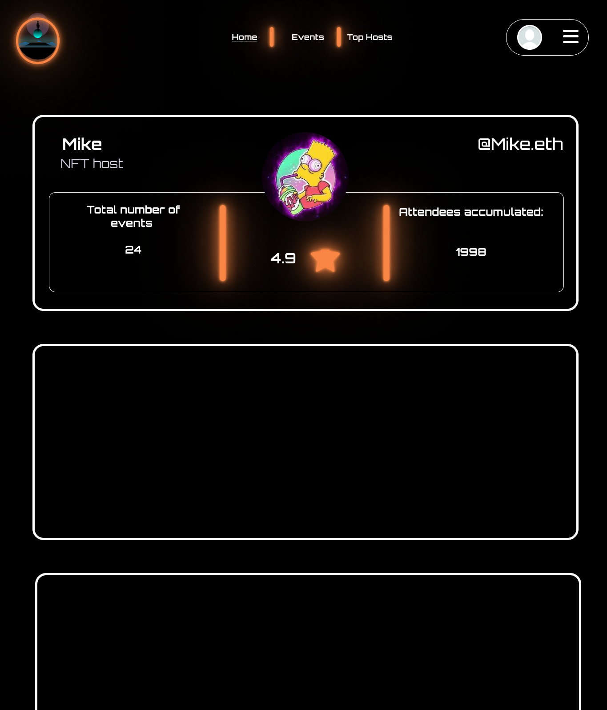
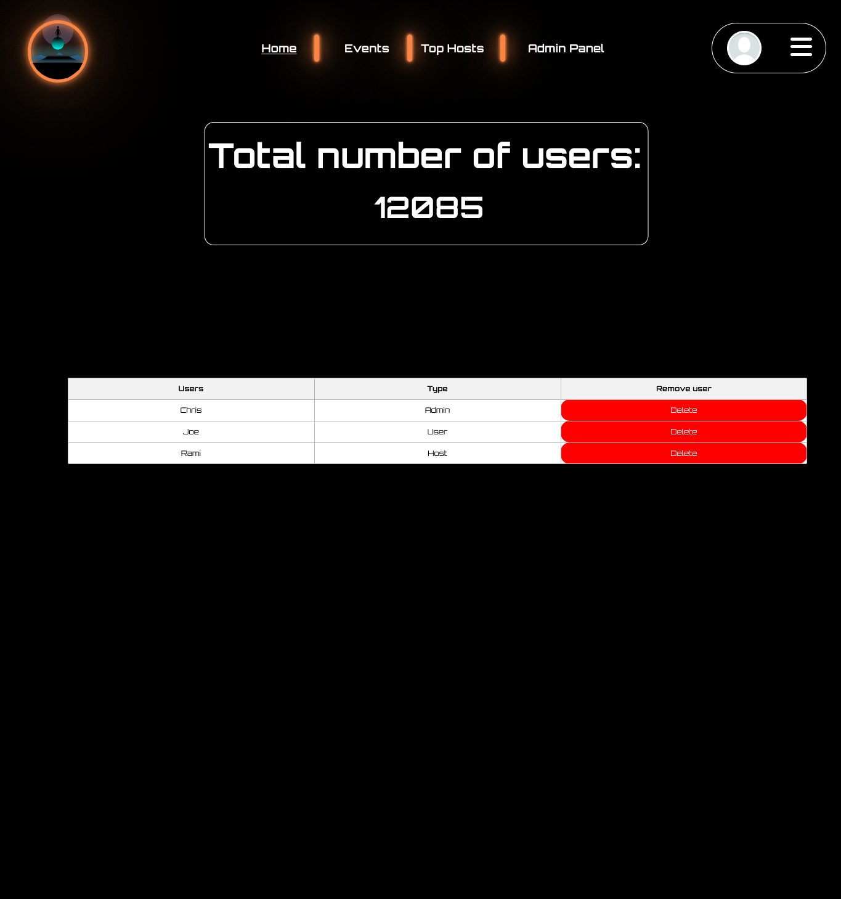

> Hello world! This is the project’s summary that describes the project plain and simple, limited to the space available. 


**[PROJECT PHILOSOPHY](#project-philosophy) • [WIREFRAMES](#wireframes) • [TECH STACK](#tech-stack) • [IMPLEMENTATION](#impplementation) • [HOW TO RUN?](#how-to-run)**

  

<a id="project-philosophy">
> Closer web app is a platform aiming to promote physical meetings for communities sharing the same interest. Closer is here to help you communicate with your fellow community members and establish a common bond.
> 
> It is pretty straight forward. You go in you look up the category you want, access the event you like and book your spot just like that.

### User Stories
- As a user, I want to go somewhere that plays only R&B music, I want to discover such places so that avoid confusion on outing destination.
- As a user, I want to see events based on their location to take into account the trip's gas consumption.
- As a user, I want to see who is making events the most and their popularity.

  

> This design was planned before on paper, then moved to Figma app for the fine details.
Note that i didn't use any styling library or theme, all from scratch and using pure css modules

| Splash  | Home/Search  |
| -----------------| -----|
|  |  |

| Sign in  | Sign up  |
| -----------------| -----|
|  |  |

| Sign up host  | Events page/Search  |
| -----------------| -----|
|  |  |

| Event page  | Host page  |
| -----------------| -----|
|  |  |

| Top hosts page  | Admin page  |
| -----------------| -----|
|  |  |

  

Here's a brief high-level overview of the tech stack the Closer app uses:
- This project uses the [Laravel framework](https://laravel.com/). Laravel is a web application framework with expressive, elegant syntax.
- As database, MySQL was used.
- Closer uses the [React](https://reactjs.org/) library for the frontend. React makes it painless to create interactive UIs, is component-based and is reusable.
- For the use of the map [Leaflet](https://leafletjs.com/) was implemented. Leaflet is the leading open-source JavaScript library.
- The project uses [react-dropzone](https://www.npmjs.com/package/react-dropzone) in order to add the drag and drop functionality.
- This project also uses [Framer-motion](https://www.framer.com/motion/) in order to animate components and add fun transitions between pages.
