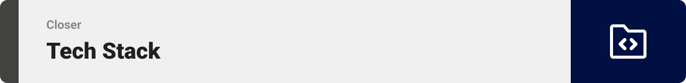

<div align="center">

> Hello, world! This is the project’s summary that describes the project plain and simple, limited to the space available. 


**[PROJECT PHILOSOPHY](#project-philosophy) • [WIREFRAMES](#wireframes) • [TECH STACK](#tech-stack) • [IMPLEMENTATION](#implementation) • [HOW TO RUN?](#how-to-run)**

</div>

<br><br>


<a id="project-philosophy">
> Closer web app is a platform aiming to promote in-person meetings for communities sharing the same interest(s). Closer is here to help you communicate with your fellow community members and establish a common bond.
> 
> It is pretty straight forward. You go in, look up the category you want, access the event you like and book your spot just like that.

### User Stories
- As a user, I want to go somewhere that only plays R&B music. I want to discover such places so that I can avoid confusion on my outing destination.
- As a user, I want to see events based on their location to take into account the trip's gas consumption.
- As a user, I want to see who is making events the most and their popularity.

<br><br>


> This design was planned before on paper, then moved to Figma app for the fine details.
Note that I did not use any styling library or theme, all from scratch and using pure CSS modules.
<a id="wireframes"></a>

| Splash  | Landing/Search  |
| -----------------| -----|
|  |  |

| Sign in  | Sign up  |
| -----------------| -----|
|  |  |

| Sign up host  | Events page/Search  |
| -----------------| -----|
|  |  |

| Event page  | Host page  |
| -----------------| -----|
|  |  |

| Top hosts page  | Admin page  |
| -----------------| -----|
|  |  |

<br><br>
<a id="tech-stack"></a>


Here's a brief high-level overview of the tech stack the Closer app uses:
- This project uses the [Laravel framework](https://laravel.com/). Laravel is a web application framework with expressive, elegant syntax.
- As database, MySQL was used.
- Closer uses the [React](https://reactjs.org/) library for the front-end. React makes it painless to create interactive UIs, is component-based and is reusable.
- For the use of the map, [Leaflet](https://leafletjs.com/) was implemented. Leaflet is the leading open-source JavaScript library.
- The project uses [react-dropzone](https://www.npmjs.com/package/react-dropzone) in order to add the drag and drop functionality.
- This project also uses [Framer-Motion](https://www.framer.com/motion/) in order to animate components and add fun transitions between pages.
- For state management, the project used [Zustand](https://github.com/pmndrs/zustand).

<br><br>
<a id="implementation"></a>


> Uing the above mentioned tech stacks and the wireframes built with figma from the user stories we have, the implementation of the app is shown as below. These are GIFs recorded from the real app.

| Splash/Signin/up/host  | Landing/Search  |
| -----------------| -----|
|  |  |

| Events/Search  | Tophosts  |
| -----------------| -----|
|  |  |

| Event  | Add event  |
| -----------------| -----|
|  |  |

| Admin  | Toasts  |
| -----------------| -----|
|  |  |

| Reserve  | Hamburger menu/ Picture in picture  |
| -----------------| -----|
|  |  |


<br><br>


> These are the instructions on setting up your project locally.
To get a local copy up and running follow these simple example steps.

### Prerequisites

This is a list of things you need to use the software and how to install them.
* npm
  ```sh
  npm install npm@latest -g
  ```
* Apache, PHP, MySQL using this [link](https://downloadsapachefriends.global.ssl.fastly.net/8.1.6/xampp-windows-x64-8.1.6-0-VS16-installer.exe?from_af=true)
* Download composer [here](https://getcomposer.org/Composer-Setup.exe)


### Installation

1. Open your XAMPP control panel and start Apache and MySQL
2. Clone the repo 
   ```sh
   git clone https://github.com/Christopher-Yammine/closer
   ```
  
3. Go into the back-end folder
   ```sh
   cd closer-backend
   ```
4. Rename the .env.example file to .env and specify your database name

5. Migrate the database schema
   ```sh
   php artisan migrate
   ```
6. Generate a secret key to handle token encryption 
   ```sh
   php artisan jwt:secret
   ```
7. Install the dependencies 
   ```sh
   composer install
   ```
8. Launch the server
   ```sh
   php artisan serve
   ```
9. Now to get the front-end up and running go into the front-end folder in a new terminal
   ```sh
   cd closer-frontend
   ```
10. Install the dependencies 
   ```sh
   npm install
   ```
11. Rename .env.example to .env.local
12. Start the application
   ```sh
   npm start
   ```
  